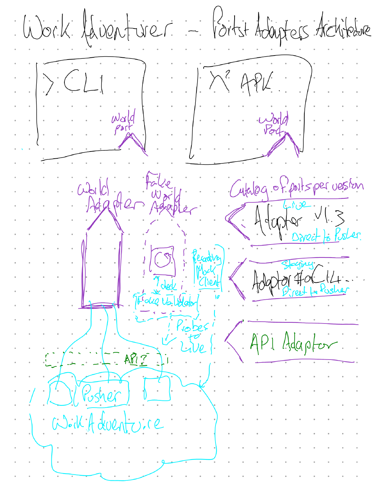

# World Port: ports & adapters refactor

**Status:** draft. Written from campey's sketch (2026-10-10); scope decisions recorded below
**Scope:** put one **World Port** between the two front-ends (the `wa` CLI/daemon
and the Android APK) and everything that talks to a WorkAdventure server. Behind
that port sits a **catalog of World Adapters, one per server version/channel**,
plus a **Fake World Adapter** that is kept honest against live servers.



## The sketch, transcribed

| sketch element | meaning |
|---|---|
| `> CLI` box, `World Port` socket | the Node `wa` CLI + daemon drive the world only through the port |
| `x² APK` box, `World Port` socket | the Android app drives the world through the same port |
| `World Adapter` (solid house) | the real implementation, wired into WorkAdventure's **Pusher** |
| `Fake World Adapter` (dashed house), its loop icon | an in-memory world for tests and offline dev |
| `Recording Mock Client` | captures what really happens against a live server |
| `check` → `Fake Validator` | replays the recordings against the fake and fails when it diverges |
| `Probes to Live` | scheduled/manual probes that run against live WorkAdventure to refresh the recordings |
| `API?` (green, dashed) | a possible future official API between us and Pusher |
| `Catalog of ports per version` | the adapters that can be plugged in: **Adapter v1.3x** (Live, Direct to Pusher; today that is v1.34), **Adapter #&lt;sha&gt;** (Staging, Direct to Pusher), **API Adapter** (future) |

## Where we are today

What already exists, and how it maps onto the sketch:

- **"Adapters" today are version profiles, not hexagonal adapters.**
  `src/adapters/wa-1.33.mjs`, `wa-1.34.mjs`, `wa-master.mjs` are data bags
  (hashes, proto path, endpoints, space-join knobs, mic mask paths) read by one
  implementation, `WorkAdventureClient`. They are the **catalog**, without the
  port. `resolveAdapter()` (probe → allowlist → default) is the catalog lookup.
- **No port.** `src/wa-daemon.mjs` reads `WorkAdventureClient` internals
  directly: `wa.ws.readyState`, `wa.pos`, `wa.spaces`, `wa.currentAreas`,
  `wa.nav`, `wa.adapter.*` (see `state()`). `WaAudio` reaches into
  `client.adapter.meeting` / `client.adapter.micState`.
- **Domain and wire live together.** `src/wa-client.mjs` (1058 lines) holds
  the envelope/protobuf framing, the S2C dispatch, space/meeting state, *and*
  avatar behaviour (`frontOf`, `followPoint`, `_faceToward`, `navTo`).
  `src/wa-audio.mjs` (962 lines) holds signalling and both media transports.
- **A second implementation of the port, in Kotlin.**
  `android/protocol/…/PusherConnection.kt` mirrors
  `WorkAdventureClient.connect/_handle/_startKeepAlive`. The Android side is
  already closer to the sketch: `nav` is its own module behind
  `MovementSink`, and `WaSession` gets its connection from a factory.
- **The catalog has already drifted between languages.** `Wa133.kt` sends
  `23c8eb8c` (the v1.34 hash) first; `src/adapters/wa-1.33.mjs` sends
  `05489a87`. There is no shared source of truth.
- **Fakes exist but are ad hoc, and nothing validates them.**
  `test/helpers/fake-pusher.mjs` is a *wire-level* fake (a WebSocket server).
  Unit tests build `new WorkAdventureClient({ adapter: { envelope: "seq-len-v1" } })`
  and poke internals. Android's `WaSessionTest` subclasses `PusherConnection`
  (`FakeConn`). None of them is checked against a recording of the real server.
- **A seed of "Probes to Live".** `scripts/selfcheck.mjs`
  (`wa selfcheck --target production`) is a live smoke test, but it asserts and
  then exits; it records nothing a fake could be checked against.

## Target architecture

```
  CLI (bin/wa.mjs, wa-daemon)      APK (WaSession, UI)
         │   Avatar services (nav, follow, greet, quiet…)   │
         └──────────────┬──────────────────────────────┬────┘
                    World Port (contract, two bindings: JS + Kotlin)
         ┌──────────────┼─────────────────┬────────────┘
  PusherWorldAdapter   FakeWorldAdapter   (ApiWorldAdapter, later)
   + version profile       ▲
   from the catalog        │ check
         │           Fake Validator ◄── recordings ◄── Recording client
         ▼                                               ▲
      Pusher ◄─────────────── Probes to Live ────────────┘
```

### 1. The World Port

A **thin** contract: the primitive things a client can do in, and learn from, a
WorkAdventure world. Anything that can be built from primitives (pathfinding,
follow, greet, "walk to player", quiet mode) sits **above** the port as an
avatar service, so it is written once per language and runs unchanged against
the fake. Android already splits it this way (`nav` + `MovementSink`).

Proposed surface. Commands are methods; everything the world tells us is an
event on one ordered stream, which is what makes recording and replay easy.

| group | commands | events |
|---|---|---|
| lifecycle | `connect(roomUrl, identity)`, `close()` | `joined{self, map}`, `closed{code, reason, rejected?}` |
| self | `move(x, y, facing, moving)`, `setMic(on)`, `bubble(kind, text)`, `clearBubble()`, `emote(e)` | none |
| presence | none (state is folded from events) | `playerJoined`, `playerMoved`, `playerLeft`, `emote` |
| areas & meetings | `acceptInvite(uuid)`, `invite(uuid)` | `areaEntered/Left`, `meetingJoined/Left{space}`, `invited` |
| chat | `chat(space, text)` | `chatMessage{space, from, text}` |
| voice signalling | `iceServers()`, `signal(space, peer, payload)` | `signal`, `livekitInvitation`, `peerMic{state}` |
| world data | `mapData()` (map + `.wam` areas + collision source) | none |

Notes:

- **Voice media stays out of the port.** The port carries *signalling* only;
  the transports (werift P2P, LiveKit) sit next to it as a separate media
  concern that the CLI and the APK already implement differently. This is the
  part of `wa-audio.mjs` that `docs/livekit.md` warns about. It moves last and
  only behind live testing.
- **Version behaviours stay inside the adapter**: mic re-announce timers,
  area-meeting debounce, space-join filter type, the area-meeting space-name
  hash, the mask paths. The port speaks in domain terms (`setMic(true)`), and
  the adapter decides how that version needs it said.
- **`ServerRejectedError` / NEW_VERSION** becomes `closed{rejected: {...}}`, so
  both front-ends handle "prod bumped" the same way.
- **The contract is defined once, as a document plus fixtures**
  (`world-port/`), and bound twice: a JSDoc `@typedef` in Node, a Kotlin
  `interface WorldPort` in Android. This respects the Android isolation rule
  (no reaching into `src/`) and is exactly the "shared core repo" that
  `android/CLAUDE.md` already plans for graduation.

### 2. The adapter catalog (per version)

Rename today's `src/adapters/wa-*.mjs` to **version profiles**. A catalog entry
is then *transport × profile*:

| entry | channel | transport | profile | stability |
|---|---|---|---|---|
| `wa-1.34` | live (`play.workadventu.re`) | direct-to-pusher | proto 1.34, hash `23c8eb8c` | frozen |
| `wa-1.33` | live (historic) | direct-to-pusher | proto 1.33, hashes `05489a87`, `bfd20fc4` | frozen |
| `wa-master@<sha>` | staging | direct-to-pusher | proto master, hash per sha | tracking |
| `api` | n/a | official API (not yet existing) | none | spike |

- The **data** half of each profile (hashes, proto path, endpoints, woka id,
  knobs, `verified`) moves to `catalog/<id>.json`, read by **both** Node and
  Gradle. That retires `Wa133.kt`'s hand-mirrored constants and the drift
  above. The few **behaviours** that are code (`areaMeetingSpaceName`) become
  named strategies (`"spaceName": "shortHash-slug-v1"`) implemented once per
  language and covered by shared fixture tests.
- The resolver (`resolveAdapter`: override → probe → allowlist → default)
  becomes the catalog lookup and gets a Kotlin twin, so the APK stops
  hardcoding one version.
- The "frozen" rule from the version-adapters spec carries over unchanged:
  live profiles are never edited for staging work.

### 3. Fake World Adapter, recordings, validator, probes

- **FakeWorldAdapter**: an in-memory world that implements the port with an
  injectable clock. Scenario helpers: `fake.addPlayer("Ana", {x, y})`,
  `fake.inviteFrom("Ana")`, `fake.rejectWith("NEW_VERSION")`. This replaces the
  `{ adapter: { envelope } }` construction hack in the Node unit tests and
  Android's `FakeConn` subclass.
- **Recording client**: a decorator over any real adapter that writes a
  **port-level transcript** (commands in, events out, relative timestamps, plus
  the raw frames for debugging) to `world-port/recordings/<profile>/<scenario>.jsonl`.
  Port-level, not wire-level, so one recording validates both the JS and the
  Kotlin fakes.
- **Fake Validator**: replays each transcript's commands into the fake and
  diffs its event stream against the recording, using order and shape and
  not exact timing. It runs in `npm test` and Gradle `test`, offline.
- **Probes to Live**: `scripts/selfcheck.mjs` grows into a set of named
  scenarios (join, walk, area meeting, invite, chat, mic, bubble) run through
  the recording client against live or staging. A probe passes when the server
  behaves as the scenario expects; its fresh transcript then replaces the
  checked-in one, and if the validator now fails, the fake (not the code) is
  stale. Probes are manual or scheduled, never in the per-PR CI, and follow the
  avatar-naming and port hygiene in `CLAUDE.md`.
- `test/helpers/fake-pusher.mjs` stays: it is the right tool for testing the
  *Pusher adapter's* wire handling (reconnect, error screen, framing).

### 4. API Adapter (the green "API?")

WorkAdventure exposes no official client API today; we speak the Pusher's
private WebSocket protocol. "API?" is a **hoped-for** API. If we end up
building one ourselves, it lives in its own repo, **not in this client repo**.
Either way, this repo only ever holds the `ApiWorldAdapter` that talks to it.
The port makes that adapter a drop-in. Until then it is a placeholder in the
catalog, not work.

## Phased plan

Each phase ships on its own, keeps `wa selfcheck --target production` green,
and changes no wire behaviour. Node goes first because it has the larger
untyped surface; Android follows because it already has most of the seams.

1. **Contract on paper.** Write `world-port/CONTRACT.md` (the table above,
   with event payload shapes) and the glossary rename (version adapter →
   version profile). No code.
2. **Node: extract the port.** Introduce `PusherWorldAdapter` as a wrapper
   around `WorkAdventureClient` that emits port events. Move `frontOf`,
   `followPoint`, `navTo` and `_faceToward` into `src/avatar/` services that
   take a port. Make `wa-daemon.mjs` depend only on the port; `state()` folds
   its view from events instead of reading `wa.ws` / `wa.spaces` / `wa.adapter`.
3. **Node: split the client.** Shrink `wa-client.mjs` into framing + dispatch
   inside the adapter; move version knobs fully into profiles. Move WaAudio's
   signalling onto the port; leave the media transports where they are.
   (Read `docs/livekit.md` and `docs/field-notes.md` first.)
4. **Shared catalog.** `catalog/*.json` plus a Node loader plus a Gradle task
   that reads `../catalog` the same way it reads `../proto`. Delete `Wa133.kt`
   constants and fix the hash-order drift in the same PR.
5. **Fake + recorder + validator (Node).** `FakeWorldAdapter`, the recording
   decorator, the transcript format, the validator in `npm test`. Port
   the `test/wa-*.test.mjs` files that build a bare client onto the fake.
6. **Probes to Live.** Scenario-ise `selfcheck.mjs`, record the first
   transcripts against `wa-1.34` (live) and `wa-master` (staging), and check
   them in.
7. **Android binds the port.** `interface WorldPort`; `PusherConnection`
   implements it; `WaSession` depends on the interface; `FakeConn` becomes a
   Kotlin `FakeWorld` validated against the *same* transcripts.
8. **API adapter spike**, only if WorkAdventure ships something to target.

## Risks

- **Voice regressions.** Mic re-announce (#10), LiveKit connect races and codec
  negotiation were each found only live. Phases 2–3 must move that code
  without changing timing. Keep the existing race tests green, and run one
  real call (logged in `docs/real-world-test-log.md`) before merging phase 3.
- **The fake gets too clever.** If the fake starts simulating server
  behaviour nobody has recorded, it will drift. Rule: the fake only does what
  some checked-in transcript shows.
- **Recordings carry personal data** (other people's names, chat text).
  Probe scenarios use our own avatars in quiet rooms, and the recorder
  redacts other players' names and chat text.

## Decisions (2026-10-10)

1. **"v1.3" in the sketch is the current live line.** The live catalog entry
   tracks whatever prod runs, which is `wa-1.34` today.
2. **The API is hoped for, not planned.** If we build one, it goes in its own
   repo; this client repo only gets the adapter.
3. **Keep prototyping in this repo.** `world-port/` (the contract and
   recordings) and `catalog/` live here, at the repo root, next to `proto/`,
   until Android graduates. They are what moves to the shared core repo
   later.

## Open questions

1. Should avatar services (follow, greet, nav) be shared across languages
   (for example as behaviour defined by fixtures), or written once per
   language? The proposal above is once per language, tested against the
   shared fake.
